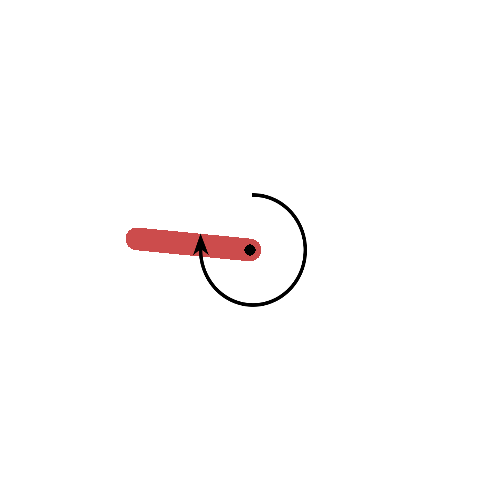
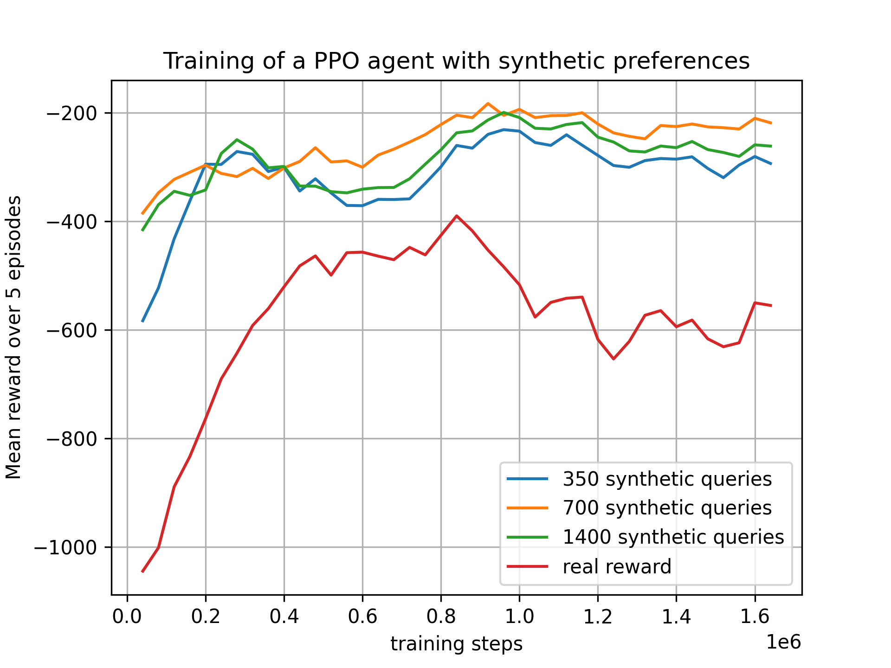

# Recreating Figure 2 of the "Deep Reinforcement Learning from Human Preferences" Paper

The code in this repository implements **deep reinforcement learning from synthetic preferences** on the **pendulum environment** of OpenAI's Gym, allowing you to recreate Figure 2 of the paper linked here: https://arxiv.org/pdf/1706.03741.pdf.

## 1. Introduction
Recreating the results in research papers can be a challenge, but it is also an essential part of scientific progress. This code provides an opportunity to gain a deeper understanding of the work done in the "Deep Reinforcement Learning from Human Preferences" paper. Specifically, the code enables the creation of the **second figure** in the paper, which demonstrates the results of deep reinforcement learning from synthetic preferences on the pendulum environment of OpenAI's Gym.

We can see in the following gif that the agent is able to learn the desired behavior (keeping the pendulum upright) after being trained with true reward and with the reward:


<table border="0">
 <tr>
    <td><b style="font-size:25px">Agent trained on true reward:</b></td>
    <td>   </td>
    <td><b style="font-size:25px">Agent trained on synthetic reward:</b></td>
 </tr>
 <tr>
    <td>     </td>
    <td>   </td>
    <td>    </td>
 </tr>
</table>


## 2. Requirements and Installation

The code was written in **Python 3.9.0** and was run on a Windows 10 machine with an AMD Ryzen 7 5800H, RTX 3070 Laptop, and 64GB RAM. To run the code, you will need to install the packages listed in the **requirements.txt** file. We recommend using a virtual environment for this purpose.

To install the required packages, run the following command:

```python
pip install -r requirements.txt

```


## 3. Usage

To run the code, simply execute the **DRLFP_Figure_2_synthetic_training.ipynb** file to train the agent and generate the desired figure. The code will generate a .png file with the generated figure and a folder for each reward function trained with synthetic preferences (the query number used for the training is indicated in the folder name), as well as a folder for the training of the agent with the real reward function. These folders contain numpy files with the rewards obtained by the agent during the training (and not during the training of the reward functions).

With the default parameters, the code will run for approximately 90 minutes and generate around 3MB of data. However, you can adjust these parameters as needed.

The figure generated by the code will provide a visual representation of the results obtained from the agent training, allowing you to analyze the data and gain insights into the performance of the system. Here is an example of the figure generated by the code:




## 4. Credits

This code was inspired by the work of the Human Compatible AI team and the tutorial found here: https://github.com/HumanCompatibleAI/imitation/blob/master/docs/tutorials/5_train_preference_comparisons.ipynb. We acknowledge their contributions and thank them for making this research available to the community.

